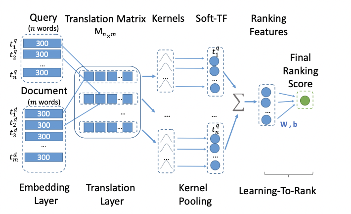
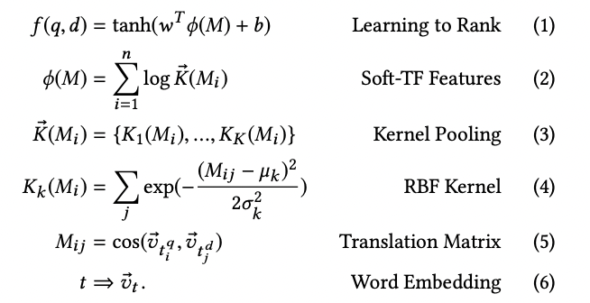

## Question recommender system, based on FAISS index and KNRM ranker
**Here you can find simple flask api with `/ping` and `/query`, which in response to a query with a question, returns 10 questions from the index that are most similar to it**


### 1. FAISS index part:
At the first stage, for the input question, the **100** closest questions (by euqlidian distance) are searched in the FAISS index. 
Each question in index represented as weighted mean of word glove embeddings with tfidf weights.

### 2. KNRM ranker:
**100** nearest neighbors come to the entrance of the pre-trained KNRM model, after reranking the top-10 similar questions are sent

#### KNRM model architecture:



#### How to use:
##### 1. Install requirements:
  - clone repo
  - download [data](https://drive.google.com/drive/folders/11cuWJFmgHkMu56rhuVYy5NoW_LYZ0Aqj?usp=sharing) to repo folder
  - `$ pip install -r requirements.txt`
##### 2*. Train model (it takes about 20 min, also it is not necessarily, pretrained weights are already in model_state folder)
- `$ python train_model.py` in case if you want to train model by yourself (it takes about 20 min)
##### 3. Run flask server:
- `$ chmod u+x run.sh`
- `$ ./run.sh`

##### 4. `/ping` until status "ok"

##### 5. `/query`
**structure:**
```python
{
  "queries" : ["How old is Barak Obama?", ..., "Why sky is blue?"]
}
```
##### 6. return:
**structure:**
```python
{
  "lang_check" : [True, ..., False], # if eng lang was detected
  "suggestions" : [
      [[<question id in index>, <similar question>], ..., [<question id in index>, <similar question>]], # suggestion ordered by relevance from most relevant to least
      ...
      [[<question id in index>, <similar question>], ..., [<question id in index>, <similar question>]]
   ]
}
```

##### example:
query:
```python
{"queries" : ["What is main life lesson?"]}
```
answer:
```python
{
    "lang_check": [
        true
    ],
    "suggestions": [
        [
            [
                "78367",
                "What are some life lesson you can give me?"
            ],
            [
                "1096",
                "What is the best lesson in life?"
            ],
            [
                "438530",
                "What is your biggest life lesson?"
            ],
            [
                "444219",
                "What is the most important lesson in life?"
            ],
            [
                "101153",
                "What's the most important life lesson?"
            ],
            [
                "152190",
                "What's the most important lesson about life?"
            ],
            [
                "125074",
                "What is the biggest lesson that life has taught you?"
            ],
            [
                "268276",
                "What is the most crucial lesson life has taught you so far?"
            ],
            [
                "165146",
                "What is your life lesson that you learn from today?"
            ],
            [
                "438531",
                "Can you tell me about your biggest life lesson?"
            ]
        ]
    ]
}
```
